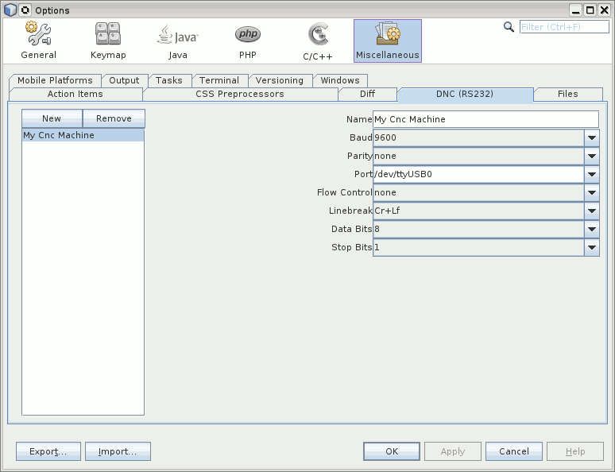
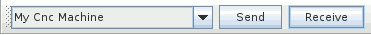
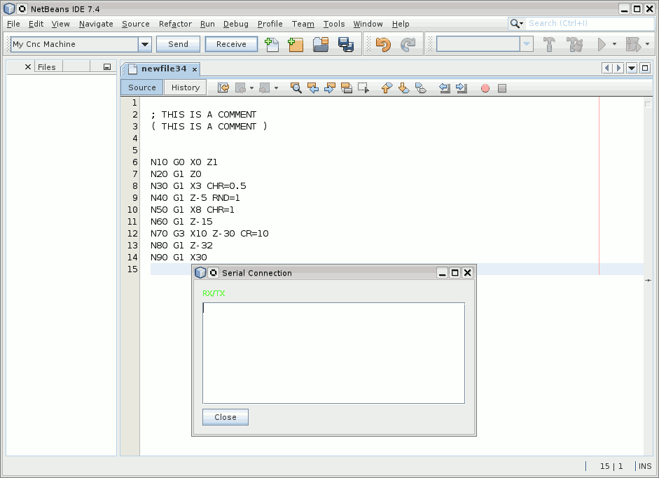

# DNC

Dnc is a netbeans module to send and receive cnc program files to or from a cnc machine over serial port (RS232). 
It is in an very early development stage. Don't use for production.

# Installation

* Download from: http://plugins.netbeans.org/plugin/60755/dnc-rs232
* Go to "Tools" -> "Plugins" -> "Downloaded", click "Add Plugins..." and select the downloaded file org-roiderh-dnc.nbm
* Check the Checkbox and click "Install"

# Usage

First add a configuration for the serial port by clicking Tools->Options->Dnc

Create a new File: "File"->"Other"->"Empty File". Select a configuration for the serial port in the toolbar drop down box.

Then click on "Receive". A Message Box appears.

Go to the Machine and start sending.
 

